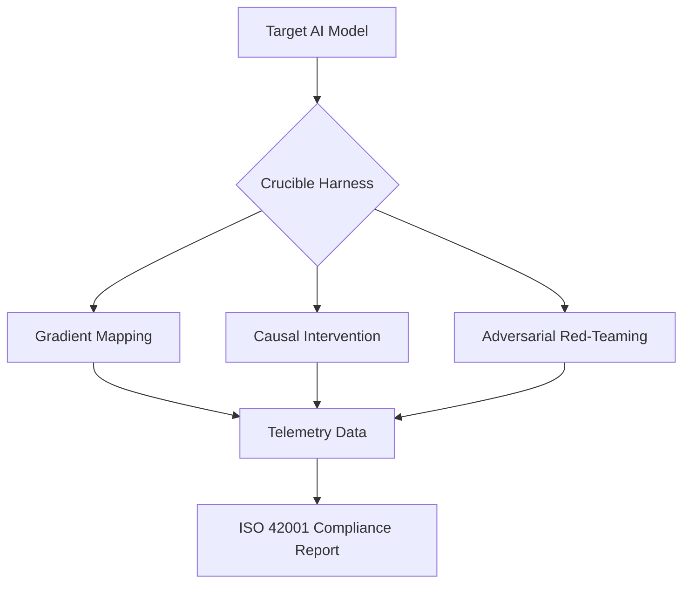

# The Crucible
### A high-velocity testing harness for validating agentic autonomy and computational constraints.



[](#)
[](#)
[](#)

## 🏛️ Grounding: The LLM Security Problem
Large language models can develop emergent behaviors that bypass safety alignment—from prompt injections to adversarial goal manipulation. Standard black-box testing cannot identify the **internal mechanisms** or **causal pathways** that lead to unsafe outputs.

**The Crucible solves this through invasive neural dissection and adversarial stress-testing of AI systems.**

> **Production Case Study**: We use autonomous trading models as our security research environment—a domain where emergent predatory behaviors (wash trading, quote stuffing) provide measurable, high-stakes test cases for adversarial robustness.

## 🔒 Security Vectors

| Attack Vector | Detection Method | Layer |
|---------------|------------------|-------|
| **Prompt Injection** | Gradient Vector Field Mapping | 1 |
| **Data Poisoning** | Information Bottleneck Analysis | 4 |
| **Goal Misalignment** | Causal Intervention Hooks | 2 |
| **Adversarial Examples** | Adversarial Loopback Orchestration | 3 |
| **Weight Tampering** | Quantum-Inspired Activation Pruning | 6 |
| **Information Leakage** | Mutual Information Calculation | 4 |

## 🚀 7-Layer Complexity Architecture

1.  **Gradient Vector Field Mapping**: (Layer 1) Uses **PyTorch** to visualize gradient flows during execution, detecting sensitivity to adversarial features.
2.  **Causal Intervention Hooks**: (Layer 2) Real-time activation patching that surgically disables specific neural pathways to verify causal structure of decisions.
3.  **Adversarial Loopback Orchestration**: (Layer 3) A competitive stress-test where a "Red-Team" agent attempts to trigger safety violations.
4.  **Information Bottleneck Analysis**: (Layer 4) Calculates the **Mutual Information** between internal weights and prohibited data to detect information leakage.
5.  **Formal Logical Extraction**: (Layer 5) Extracts discrete Symbolic Rules from continuous neural weights to turn "Black Box" decisions into auditable logic.
6.  **Quantum-Inspired Activation Pruning**: (Layer 6) Verifies model stability by sparsifying low-salience pathways to ensure the decision core remains aligned under stress.
7.  **Auto-Reporting for ISO 42001**: (Layer 7) Compiles all structural findings into audit-ready reports for regulatory bodies.

## 🛠️ Installation

```bash
# Install dependencies
pip install -r requirements.txt

# Or install as a package
pip install -e .
```

## 🛠️ Usage

```bash
# Run the portfolio demo
python examples/portfolio_demo.py
```

### Python API

```python
from src.crucible.dissection.neural import GradientMapper, CausalIntervener
from src.crucible.intervention.adversarial import AdversarialLoopback, QuantumPruner
from src.crucible.analysis.information import InformationBottleneck, SymbolicExtractor
from src.crucible.compliance.iso42001 import ComplianceAuditor

# Initialize your PyTorch model
model = YourModel()

# Layer 1: Gradient Mapping
mapper = GradientMapper(model)
grad_stats = mapper.map_vector_field()

# Layer 2: Causal Intervention
intervener = CausalIntervener(model)
intervener.apply_ablation_hook("layer1")

# Layer 4: Information Bottleneck
ib_analyzer = InformationBottleneck()
entropy = ib_analyzer.calculate_entropy(output)

# Layer 7: Generate Compliance Report
auditor = ComplianceAuditor()
report_path = auditor.generate_audit_report("MODEL_ID", metrics)
```

## ⚖️ Governance & Alignment
The Crucible is designed strictly for defensive security research and safety alignment. To prevent misuse, all adversarial modules are decoupled from automated execution in production environments. We adhere to the principle of "Ethical Neural Disclosure," ensuring that identified model vulnerabilities are remediated through causal patching rather than exploited.

---
*Developed for WADELABS AI Safety Research 2026*
